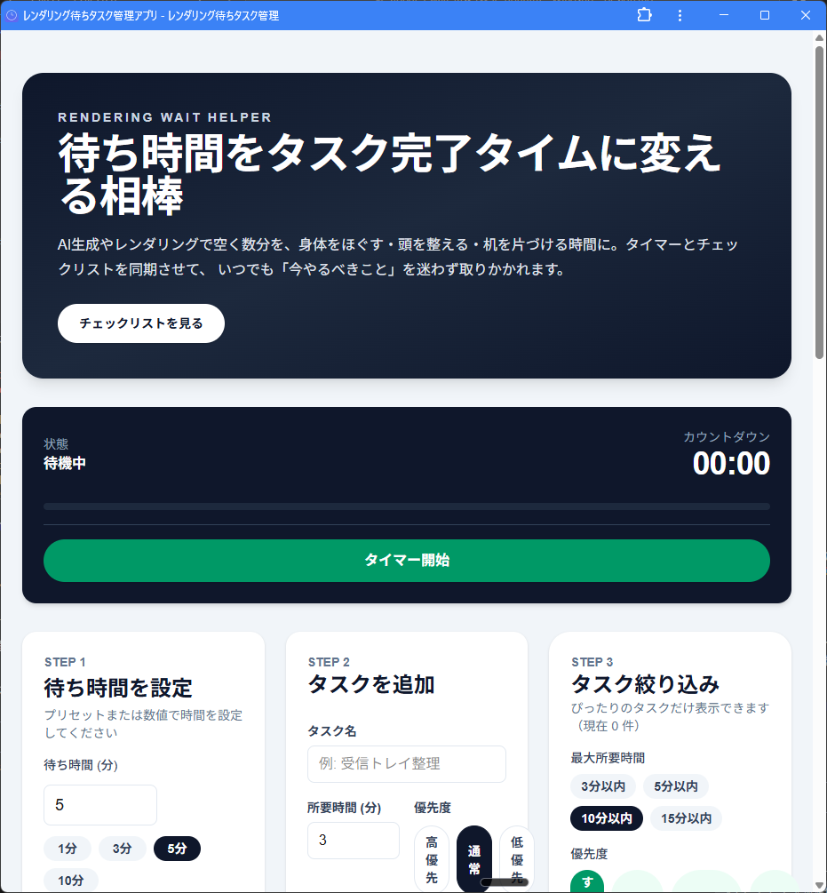

# Rendering Wait Task Manager

AIレンダリングやビルド待ちの数分を有効活用するためのタスク管理アプリです。タイマーとタスクリスト、ポップアップ、AI提案までワンストップで扱えます。

## 開発環境

- Node.js 18+
- npm

```bash
npm install
npm run dev
```

ブラウザで [http://localhost:3000](http://localhost:3000) を開いて利用します。

## 主な機能

- タスクの追加/削除/完了チェック、所要時間・優先度設定
- フィルターで所要時間や優先度に応じてリストを絞り込み
- タイマー開始でポップアップが自動表示し、残り時間に適したタスクのみを提示
- 通知＆サウンド：タイマー完了時にブラウザ通知と効果音を再生
- AI連携（Gemini API）：
  - フォームで「AIで分類」→ 推定カテゴリ/所要時間/優先度を自動補完
  - 「AIに聞いてみる」で待ち時間に最適なタスクを提案
  - 統計画面からAIアドバイスを取得して振り返り
- 統計/設定：今日・週間の実績を確認し、通知やポップアップ設定、APIキーを管理

## スクリーンショット



## テスト

```bash
npm test          # ユニット/コンポーネントテスト
npm run typecheck # TypeScript チェック
npm run test:e2e  # Playwright E2E（Chromium）
```

Playwright のブラウザが未インストールの場合は `npx playwright install` を先に実行してください。

## ビルド

```bash
npm run build
```

成功すると `.next` にビルド成果物が生成されます。`npm start` で本番モード起動が可能です。

## 環境変数

- `NEXT_PUBLIC_GEMINI_MODEL` (任意) : 使用する Gemini モデル名
- `GEMINI_API_KEY` はブラウザ側で設定モーダルから保存されます（LocalStorage）

## フォルダ構成

- `app/components` : UI コンポーネント群
- `app/lib` : タイマー/AI/通知/タスクユーティリティ
- `store/useTaskStore.ts` : Zustand ストア
- `tests/` : Playwright シナリオ
- `__tests__/` : Jest + RTL テスト

## 作業の流れ

1. タスクを登録・フィルタ
2. 待ち時間を設定してタイマー開始
3. ポップアップで推奨タスクをこなし、完了すると統計に反映
4. AI提案/アドバイスを必要に応じて呼び出し
